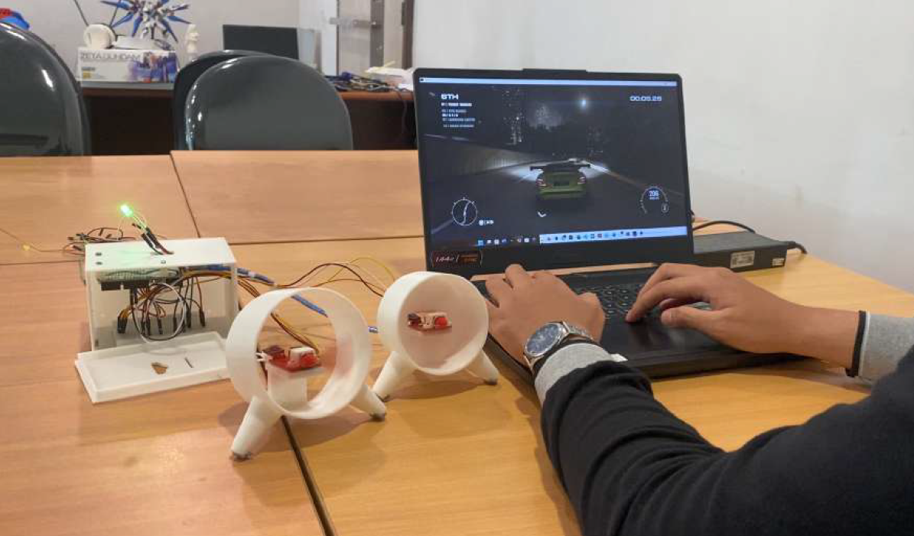
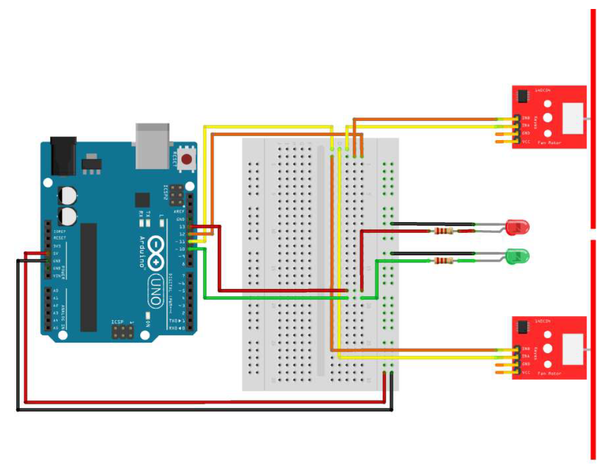
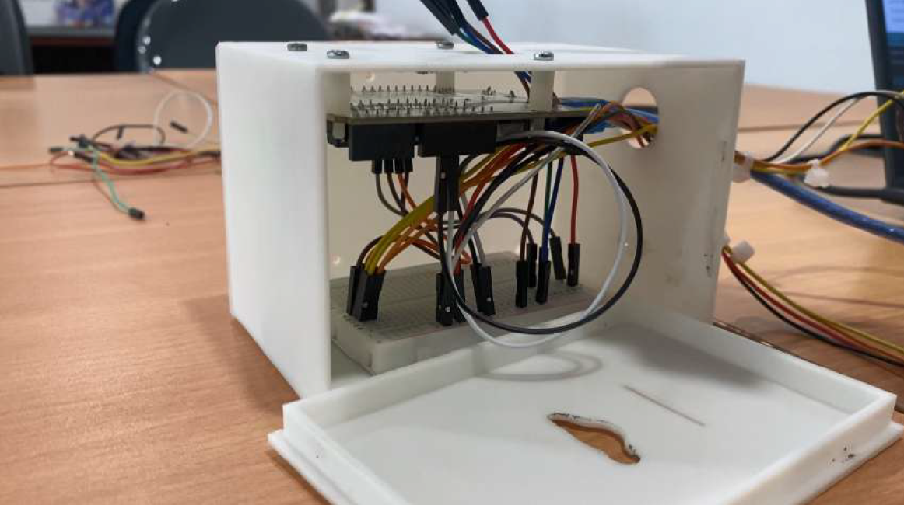
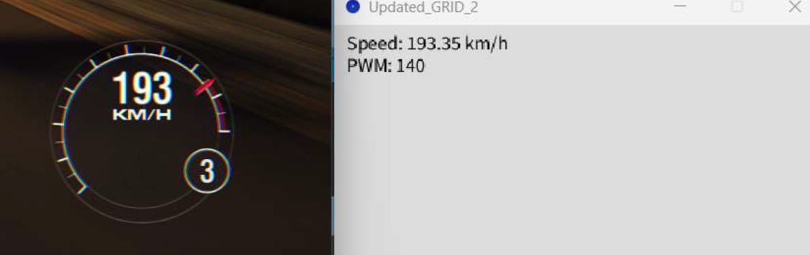
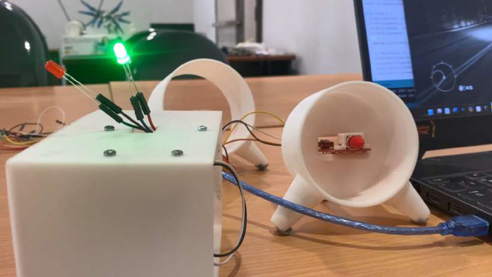
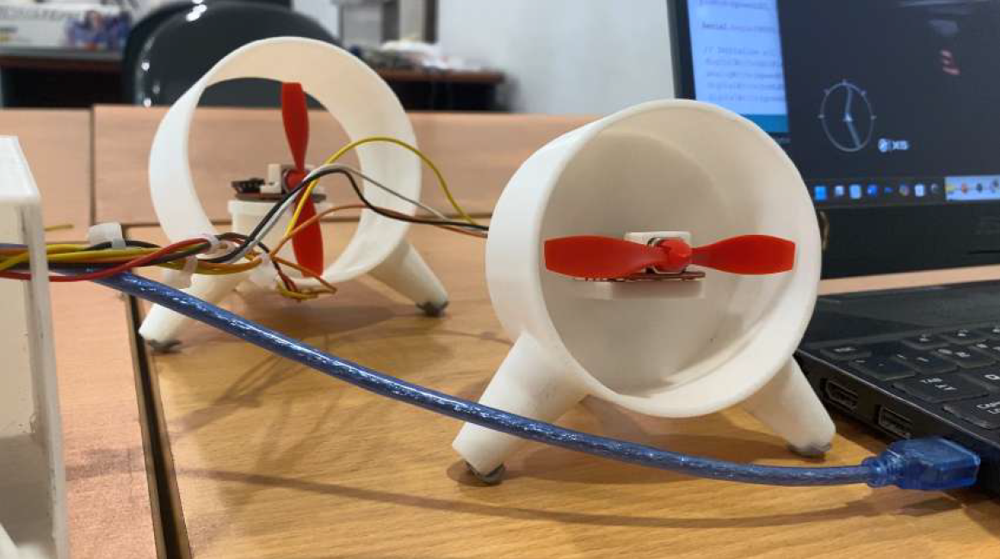

# AEROBOOST: Real-Time Speed Fan Controller

AEROBOOST is an embedded system project that enhances racing game immersion by simulating real-world airflow based on a vehicle's in-game speed. The system extracts real-time telemetry data from **GRID 2**, processes the vehicle speed using a Processing-based middleware, and converts it into PWM signals to control DC fans through an Arduino.

By synchronizing physical airflow with in-game vehicle speed, AEROBOOST adds a tactile dimension to the racing experience beyond conventional visual and audio feedback.

<p align="center">
  
</p>

## Features

- Real-time vehicle speed extraction through UDP telemetry
- Telemetry processing using Processing
- Serial communication between the PC and Arduino
- PWM-based DC fan speed control
- Dual fan setup for airflow simulation
- LED indicators for system status
- Kick-start mechanism for reliable motor startup
- PWM smoothing to provide more gradual fan speed transitions
- Fan housing for physical protection

## System Architecture

AEROBOOST consists of four main components:

1. **Racing Game** — GRID 2 provides vehicle telemetry, including speed data, through UDP.
2. **Processing Middleware** — Receives UDP packets, extracts vehicle speed, maps it to a PWM value, and sends the value over serial.
3. **Arduino** — Receives the PWM value and generates control signals for the fan motors.
4. **Fan Actuators** — Two DC fans produce airflow that changes with the vehicle's in-game speed.

<p align="center">
  
</p>

## Hardware

| Component | Function |
|---|---|
| Arduino Uno R3 | Receives serial data and controls the fans |
| DC Motors | Drive the fan blades |
| Two DC Fans | Generate physical airflow |
| L9110 Motor Drivers | Control motor operation |
| Red and Green LEDs | Provide visual status indicators |
| Breadboard and Jumper Wires | Connect the system components |
| USB Connection | Provides serial communication between the PC and Arduino |

The fan modules use onboard L9110 motor drivers. Both fans are controlled together to simplify the hardware and control logic.

### Hardware Implementation

<p align="center">
  
</p>

## Software Architecture

The software consists of two main components: the Processing middleware running on the PC and the Arduino firmware controlling the fans.

### 1. Game Telemetry

GRID 2 sends telemetry packets over UDP when telemetry output is enabled in its configuration file. The system uses the vehicle's speed as the primary input for fan control.

Example configuration:

```xml
<motion enabled="true" ip="127.0.0.1" port="20777" delay="1"
extradata="1" udpversion="1" />
```

The configuration directs telemetry to the local computer through UDP port `20777`.

### 2. Processing Middleware

The middleware receives telemetry packets, extracts vehicle speed, converts it to km/h, and maps it to a PWM value between `0` and `255`.

```java
byte[] data = packet.getData();
float speed = getFloat(data, 28) * 3.6;
int pwm = (int)map(speed, 0, 350, 0, 255);

pwm = constrain(pwm, 0, 255);
```

The resulting PWM value is sent to the Arduino through serial communication at `9600` baud. Updates are sent when the PWM value changes sufficiently, reducing unnecessary serial transmissions.

### Middleware Demonstration

<p align="center">
  
</p>

### 3. Arduino Fan Control

The Arduino receives the PWM value over serial and uses it to control the motor drivers.

The system incorporates a **kick-start mechanism**: when a fan transitions from an off state to an active state, it briefly receives maximum PWM (`255`) for `150 ms` before adjusting to the requested value. This helps the motor overcome startup inertia at low PWM values.

An exponential moving average (EMA) low-pass filter is also used to smooth rapid changes in PWM, making airflow transitions more gradual.

## Control Logic

The system maps vehicle speed to fan speed through the following process:

```text
GRID 2
  |
  | UDP Telemetry
  v
Processing Middleware
  |
  | Extract Vehicle Speed
  | Convert Speed to PWM (0–255)
  v
Serial Communication
  |
  v
Arduino Uno R3
  |
  | PWM Control
  v
L9110 Motor Drivers
  |
  v
Dual DC Fans
  |
  v
Physical Airflow
```

As the vehicle accelerates, the fan speed increases. When the vehicle slows down, the fan speed decreases accordingly.

## LED Indicators

Two LEDs provide additional visual feedback during operation.

| Indicator | Behavior |
|---|---|
| Red LED | Turns on when PWM is `0` |
| Green LED | Turns on when PWM exceeds the configured threshold |

These indicators help users observe the system's operating state without relying entirely on the middleware display.

## Testing and Results

The system was tested using GRID 2 telemetry to verify the relationship between incoming PWM values, LED indicators, and fan operation.

The report documents three repeated trials for each tested condition.

| Test Condition | Expected Behavior | Reported Result |
|---|---|---|
| PWM equals `0` | Red LED turns on | Successful in all three trials |
| PWM is non-zero | Red LED turns off | Successful in all three trials |
| PWM is below the configured threshold in the threshold-based implementation | Green LED remains off and fan stops | Successful in all three trials |
| PWM exceeds the configured threshold in the threshold-based implementation | Green LED turns on and fan runs | Successful in all three trials |

The project was also demonstrated as an integrated setup, with GRID 2 running on the PC, Processing receiving telemetry, and the Arduino controlling the physical fans.

### Integrated System Demonstration

<p align="center">
  
</p>

### Fan Housing

<p align="center">
  
</p>

## Safety and Error Handling

Several measures are considered to improve operational safety and stability:

- **Input validation:** Vehicle speed is checked against a logical range of `0–350 km/h`.
- **PWM limits:** Control values are constrained to the range `0–255`.
- **Physical protection:** Fan housing helps prevent direct contact with rotating blades.
- **Error handling:** The middleware continues waiting for valid data when telemetry or serial communication encounters errors.
- **Electrical isolation:** A USB isolator or optocoupler is suggested as an additional protection measure.

## Limitations

- The current implementation uses a wired USB serial connection between the PC and Arduino.
- GRID 2 is the primary game used for implementation and testing.
- The system depends on the availability and correct configuration of game telemetry.
- The hardware uses compact DC fan modules, which limit the airflow compared with larger fans.
- Broader compatibility with other racing games requires additional integration and testing.

## Future Improvements

Potential improvements identified in the project report include:

- A graphical interface for monitoring vehicle speed and adjusting fan limits.
- More robust telemetry handling and compatibility with additional racing games.
- Improved fan housing and modular hardware design.
- Additional power management to reduce overheating and extend component lifespan.
- Wireless communication through Bluetooth or Wi-Fi.
- Portable operation using a battery or power bank.

## Project Context

Developed as a final project for the **Game Technologies** course in the Computer Engineering program at Universitas Brawijaya.

AEROBOOST demonstrates the integration of game telemetry, real-time data processing, embedded control, and physical feedback to create a more immersive racing experience.
